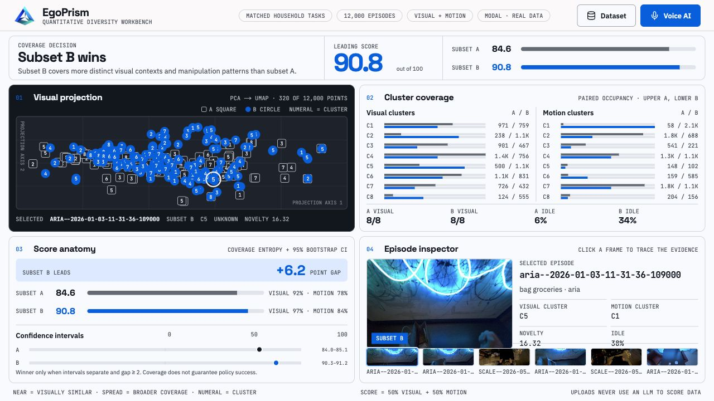
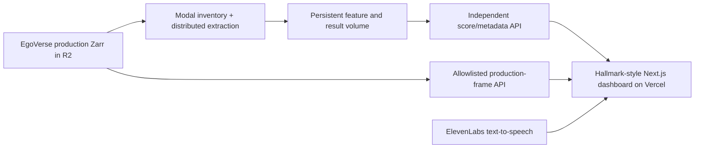

# EgoPrism

**A quantitative diversity workbench for choosing better egocentric robot datasets.**

[Live dashboard](https://egoprism.vercel.app) · [Modal data API](https://ts5789--egoprism-api-summary.modal.run) · [Source code](https://github.com/7dracoder/EgoPrism)



## The idea

Robot-learning teams often compare datasets by episode count or captions. Those
numbers can hide visual repetition and narrow manipulation behavior. EgoPrism
answers a more useful question:

> Given two comparable dataset slices, which one covers a broader range of
> visual contexts and motion patterns?

EgoPrism measures that coverage directly from real front-camera frames and
robot motion. Captions, task labels, voice, and language models never influence
the score.

This project targets **Track 2: Quantitative Diversity Measurement**.

## Result

EgoPrism compared two frozen, task-family-matched subsets containing **12,000
unique production EgoVerse episodes**.

| | Subset A | Subset B |
|---|---:|---:|
| Role | Single-source baseline | Multi-source candidate |
| Episodes | 6,000 Scale | 1,615 Aria + 1,597 Eva + 2,788 Scale |
| Duration | 110.17 hours | 114.78 hours |
| Visual entropy | 0.915 | 0.975 |
| Motion entropy | 0.777 | 0.841 |
| Diversity score | **84.63** | **90.79** |
| 95% bootstrap interval | 83.97–85.12 | 90.31–91.24 |

**Subset B wins by 6.2 points.** Its examples are distributed more evenly
across both visual and motion clusters. The confidence intervals do not overlap,
and the gap is larger than the required two-point decision threshold.

This is a dataset-selection signal. It does not claim that a higher score alone
guarantees a better trained robot policy.

## Real-data validation

The production pipeline uses EgoVerse Zarr episodes stored in R2:

- **22,852** production episodes inventoried across Aria, Eva, and Scale.
- **22,849** episodes successfully decoded and extracted.
- Three source episodes excluded: one empty image array and two corrupt image
  blobs.
- **12,000 independent recordings** selected for the judged comparison.
- Zero duplicate episode IDs and zero overlap between A and B.
- Identical quotas across five task families.
- Total duration differs by less than 5%.
- No synthetic rows, repeated fixtures, or count expansion.

Each subset contains the same task-family allocation: 2,610 folding/laundry,
1,300 groceries, 900 object-in-container, 500 cup-on-saucer, and 690 utensil
sorting episodes.

## What judges can try

The dashboard is a fixed, single-screen evidence cockpit built in the visual
language of Hallmark's Cobalt workbench.

1. Read the winner, score gap, and confidence intervals at a glance.
2. Select any point in the projection to trace it to an episode.
3. Inspect cleared production footage, source, task, clusters, novelty, and idle
   fraction.
4. Open **Dataset** to search and paginate the complete 12,000-row index.
5. Upload another valid EgoPrism comparison JSON to replace all four panels in
   the current browser tab.
6. Open **Voice AI** and ask which subset won, whether the data is real, how the
   score works, or how to read a chart. The assistant continues listening until
   **End conversation** is pressed.

## How to read the four panels

### 1. Visual projection

The dark plot shows a deterministic, subset-and-cluster-stratified sample of up
to 320 episodes from the complete comparison. Outlined squares are A, blue
circles are B, and each numeral is a visual cluster. Nearby marks have similar
visual fingerprints.

The two projection axes have no standalone semantic meaning, and screen
distance is not the score. The projection is an inspection map; scoring happens
in the standardized feature space using all 12,000 episodes.

### 2. Cluster coverage

Every row represents one cluster. The upper bar is A, the lower bar is B, and
the label at right is `A / B`. Both subsets reach all eight clusters, but B has
more even occupancy. That balance produces its higher entropy.

### 3. Score anatomy

The component bars show visual and motion coverage. The confidence chart shows
the 95% episode-bootstrap interval for each score. EgoPrism declares a winner
only when the intervals do not overlap and the score gap is at least two points.

### 4. Episode inspector

Selecting a projection mark or thumbnail reveals its real production frame,
source, task family, visual cluster, motion cluster, novelty, and idle fraction.
Frame delivery is independent of score delivery, so the quantitative result
remains available even if a preview request is slow.

## Scoring method

For every episode, EgoPrism:

1. Samples eight evenly spaced real front-camera frames.
2. Builds a normalized color-and-spatial visual fingerprint.
3. Summarizes hand trajectory, speed, idle time, bimanual coordination, and
   available head motion.
4. Winsorizes pooled motion features at 0.5% and 99.5% to contain sensor
   glitches, then standardizes pooled A+B features.
5. Clusters visual and motion features independently with eight clusters.
6. Measures normalized cluster-occupancy entropy.

The final 0–100 score is:

```text
50 × visual entropy + 50 × motion entropy
```

Uncertainty is estimated with 200 whole-episode bootstrap resamples. The idle
speed threshold is 0.02 m/s. Metadata is displayed for traceability but is not
a score input.

## Architecture



- **Modal** inventories the production hierarchy, runs distributed frame and
  motion extraction, stores the prepared comparison, serves score metadata, and
  retrieves cleared frames on demand.
- **Vercel + Next.js** serve the responsive single-screen dashboard, dataset
  drawer, upload validation, and protected voice routes.
- **ElevenLabs** speaks grounded answers generated from the active comparison.
  The API key remains server-side and voice never participates in scoring.
- **R2 credentials** remain inside a private Modal secret and are never exposed
  to the browser.

The score/metadata endpoint and frame-preview endpoint are deliberately
independent. Production frames have been explicitly cleared for public display
and are served through the Modal preview allowlist; changing preview
availability cannot change the stored result.

## Why the result is useful

Both subsets contain the same number of episodes and the same task-family
quotas, with closely matched duration. The main experimental difference is
source breadth: A uses only Scale, while B mixes Aria, Eva, and Scale.

The measured outcome supports a practical collection decision: under this
matched comparison, multi-source data adds broader visual and motion coverage
than adding the same number of episodes from the single-source baseline.

## Responsible interpretation

- The result applies to this frozen 12,000-episode comparison and its five task
  families, not automatically to every EgoVerse task.
- The current RGB fingerprint is a lightweight screening feature, not a
  semantic foundation-model embedding.
- Coverage entropy measures breadth, not annotation quality or downstream
  policy performance.
- Missing motion is labeled rather than invented.
- The assistant explains the evidence; it cannot modify the score.

## Built with

Modal · EgoVerse · Cloudflare R2 · Next.js · React · Vercel · ElevenLabs ·
Python · NumPy · pandas · scikit-learn · Zarr
