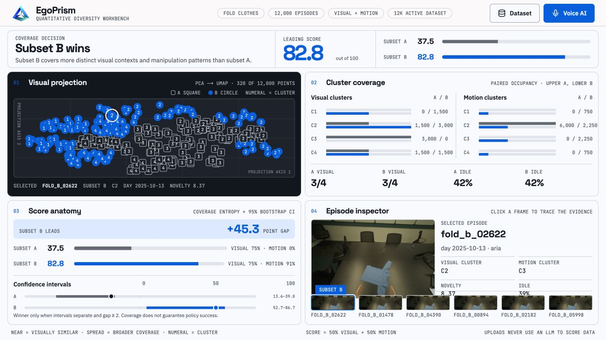

# EgoPrism

A dashboard that compares two frozen, task-matched EgoVerse subsets and reports which one is more diverse — from **pixels and motion**, not captions or an LLM.

- **Live dashboard:** [egoprism.vercel.app](https://egoprism.vercel.app)
- **Live Modal data API:** [EgoPrism summary endpoint](https://ts5789--egoprism-api-summary.modal.run)
- **Source repository:** [github.com/7dracoder/EgoPrism](https://github.com/7dracoder/EgoPrism)

Vercel is connected to this repository with `main` as the production branch and
`web/` as the project root. Every push to `main` creates a production deployment;
other branches and pull requests receive preview deployments.

**Demo statement:** For the same task and similar dataset size, this tool shows that subset B covers more distinct visual contexts and manipulation patterns than subset A.

**Data status:** The initial web cockpit contains **12,000 deterministic episode
summary rows**—6,000 per subset—so charts, search, pagination, upload, and
selection are exercised at realistic UI scale. They reference **16 extracted
fold-clothes source episodes** with clear 640×480 frames. The repeated summary
rows are not 12,000 additional recordings, and the confidence intervals remain
tied to the 16 scored source episodes.



This is Track 2 (Quantitative Diversity Measurement). It is a data-selection signal, not a claim that a higher score trains a better robot.

## Run the Hallmark dashboard

The production UI is a Next.js 16 App Router app in `web/`. It uses Hallmark's
modern-minimal Workbench structure and Cobalt theme as a fixed viewport cockpit:
the decision and four evidence panels stay on one screen with no page-level
vertical scrolling. It fetches the read-only Modal summary endpoint and expands
the recognized 16-episode comparison into a deterministic 12,000-row interface
index. A bundled payload and the same extracted episode frames provide the same
result if Modal is temporarily unavailable.

```bash
cd web
npm install
cp .env.example .env.local
npm run dev
```

Set `MODAL_API_URL` in `web/.env.local` to the endpoint above. Add
`ELEVENLABS_API_KEY` only when testing the spoken answers locally. Both values
are server-only; never prefix either one with `NEXT_PUBLIC_`.

Production verification:

```bash
cd web
npm run typecheck
npm run build
```

## Run the Streamlit reference

From `EgoPrism/` with the project venv (`source ../.venv/bin/activate` if you are in the parent `Modal` folder):

```bash
pip install -r requirements.txt
export EGOPRISM_DATA_ROOT=/path/to/the/fold-clothes-cache
python scripts/extract.py
python scripts/export_web_data.py
streamlit run app.py
```

Open [http://localhost:8501](http://localhost:8501). This preserves the original
local analysis surface; the Vercel dashboard above is the judged presentation UI.

Optional **live briefing** (ElevenLabs, not a judge):

```bash
export ELEVENLABS_API_KEY=...
```

Alternatively, copy `.streamlit/secrets.toml.example` to `.streamlit/secrets.toml`
and put the key there. Never commit that file or expose the key in browser code.
Then click **Play voice briefing**. The spoken copy is the deterministic ranking
already on screen. Audio is cached under `artifacts/audio/`; voice never changes
the score.

Tests:

```bash
pytest -q
```

Cloud extract (CPU by default, writes into the `egoverse-data` volume at `/data`):

```bash
modal run modal_extract.py
```

Deploy the read-only web payload endpoint:

```bash
modal deploy modal_api.py
```

The persistent Modal volume holds the scored feature parquet used by the public
summary endpoint. The bundled comparison is a deterministic fallback for that
same payload.

GPU is not on the default path. `gpu_ready` exists as an optional probe if you later need to generate embeddings that are missing from the zarr.

## What is being compared

The current source comparison contains two **fold-clothes** subsets with eight
extracted episodes each. The web layer deterministically expands each side to
6,000 interface summary rows while retaining the source cluster distribution
and preview-frame mapping.

| | Subset A | Subset B |
|---|---|---|
| Scenes | 1 recorded day | 8 recorded days |
| Source episodes | 8 | 8 |
| Motion clusters | 1 of 4 | 4 of 4 |

Swap the CSV manifests and `.zarr` stores to point at a real EgoVerse slice. The reader already expects `images.front_1`, optional `dino.front_img_1`, and whichever of `left/right.obs_ee_pose` plus `obs_head_pose` exists.

## Score

1. Standardize visual and motion features on the pooled A+B set.
2. Cluster each family with \(K=\min(8,\lfloor\sqrt{n}\rfloor)\).
3. Normalized entropy \(-\sum p\log p / \log K\).
4. `diversity_score = 50 × visual_entropy + 50 × motion_entropy` (0–100). Visual-only if usable motion is absent.
5. Bootstrap episodes 200 times. Declare a winner only when 95% CIs do not overlap and the gap is ≥ 2 points; otherwise **no clear difference**.

Idle speed threshold: **0.02 m/s**. Eight evenly spaced front frames per episode. DINO vectors are L2-normalized, then mean-pooled. Poses are rewritten into the current head frame when head pose exists.

Lab, scene, and other metadata are filters and labels. They are not score inputs.

## How to read the evidence

- Desktop shows four panels simultaneously. Smaller screens use four panel tabs
  while the app still stays inside one viewport.
- The score rows show the 0–100 diversity score, its visual and motion
  components, and a 95% episode-bootstrap interval.
- In the dark visual projection, each mark is a representative episode:
  outlined squares are A, teal circles are B, and the numeral is its visual
  cluster. To keep the fixed cockpit responsive, this panel uses a deterministic
  subset- and cluster-stratified sample of at most 320 points and states the
  sample size in its header. The coverage counts, entropy scores, confidence
  occupancy counts and dataset index use all 12,000 summary rows. Confidence
  intervals remain the source-episode intervals. Nearby marks have more
  similar image embeddings. PCA followed by UMAP produces this 2D inspection
  map when UMAP is available.
- Projection axes have no standalone semantic meaning, and screen distance is
  not the score. Clusters are fit in the standardized feature space; normalized
  cluster-occupancy entropy produces the score.
- The coverage panel shows both visual and motion occupancy. In each row, the
  upper bar is A, the lower bar is B, and the count at right is `A / B`. The
  current comparison has both A and B in 3/4 visual clusters; the larger
  separation comes from motion, where A uses 1/4 and B uses 4/4.
- The score panel combines the component bars with a 0–100 confidence-interval
  chart. The episode inspector connects a selected point to its frame, scene,
  lab, cluster, novelty, and idle metrics.

## Use another comparison

Click **Dataset** in the top-right corner. The side drawer exposes the complete
episode index with search and 100-row pagination, and accepts an EgoPrism
comparison JSON up to 25 MB. A valid file immediately replaces the bundled
comparison in all four panels for the current browser tab; **Restore initial
dataset** switches back to the 12,000-row index.

This upload is intentionally the scored comparison payload, not raw Zarr. Raw
EgoVerse data still needs the Python extraction and clustering pipeline first.
The browser validates project identity, subset summaries, unique episode IDs,
episode counts, cluster ranges, occupancy arrays, and method fields. Uploaded
data stays local to the browser and is not sent to Vercel. Preview images render
when the payload uses a bundled `/episodes/...` path or an embedded data URI;
otherwise the inspector displays a clear placeholder.

The full plain-language walkthrough, including the exact fixture occupancy and
what not to infer from UMAP, is in `../EGOPRISM_COMPLETE_PROJECT_GUIDE.md` in
the parent workspace.

## Layout

```text
EgoPrism/
├── web/                   Hallmark Next.js dashboard + server voice route
├── app.py                 Streamlit reference dashboard
├── modal_api.py           Modal read-only comparison endpoint
├── modal_extract.py       Modal CPU extractor
├── src/                   IO, features, metrics, fixtures
├── data/manifests/        subset_a.csv, subset_b.csv
├── tests/
├── artifacts/             cached parquet + previews (generated)
├── summary-slide.html     one-slide story
└── README.md
```

## Limitations

- Sixteen extracted source episodes support the current A/B comparison. The web
  layer expands their summaries to 12,000 rows for interface-scale testing. Do
  not describe those rows as 12,000 independent captures or use the small source
  sample as a broad population claim.
- A higher score is cluster coverage, not guaranteed robot success.
- Missing motion is labeled, not invented.
- ElevenLabs is optional demo audio. It does not score subsets.

## ElevenLabs integration

EgoPrism has two separate voice experiences:

1. The deterministic **Play briefing** control calls text-to-speech from server
   code only—the Next.js route in production or Streamlit locally. It uses the
   George voice, `eleven_flash_v2_5`, and MP3 44.1 kHz / 128 kbps output by
   default. Override it with `EGOPRISM_ELEVEN_VOICE_ID` and
   `EGOPRISM_ELEVEN_MODEL_ID`.
2. The **Voice AI** control opens a compact answer bubble, starts listening,
   maps each spoken question to versioned, verified EgoPrism knowledge, and uses
   ElevenLabs to speak the answer. Only the latest assistant answer is shown as
   text. After each spoken response the microphone opens again automatically,
   continuing until the user presses **End conversation**; ending leaves the
   final answer visible.
   `/api/voice-agent/answer` performs the grounded mapping;
   `/api/voice-agent/speak` performs server-only text-to-speech.

Use a restricted ElevenLabs key with only text-to-speech permission and
conservative account usage limits. The spoken answers come from a fixed topic
set and are CDN-cacheable, which limits both hallucination and repeated cost.
The key is never used from client-side JavaScript and voice is never part of the
diversity calculation.

On Vercel, `ELEVENLABS_API_KEY` is a sensitive Production-only variable.
`MODAL_API_URL` is available to Production, Preview, and Development. The public
`/api/health` route returns configuration booleans only and never returns values.
